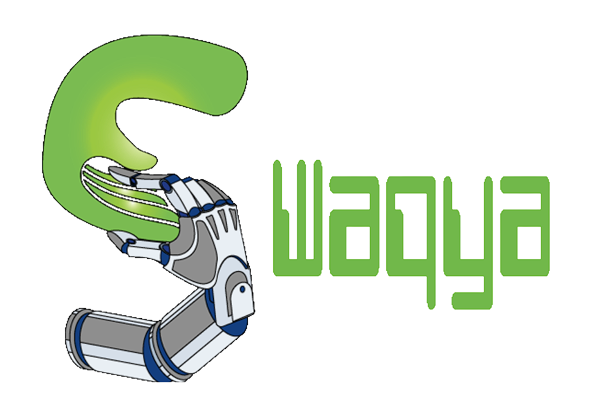
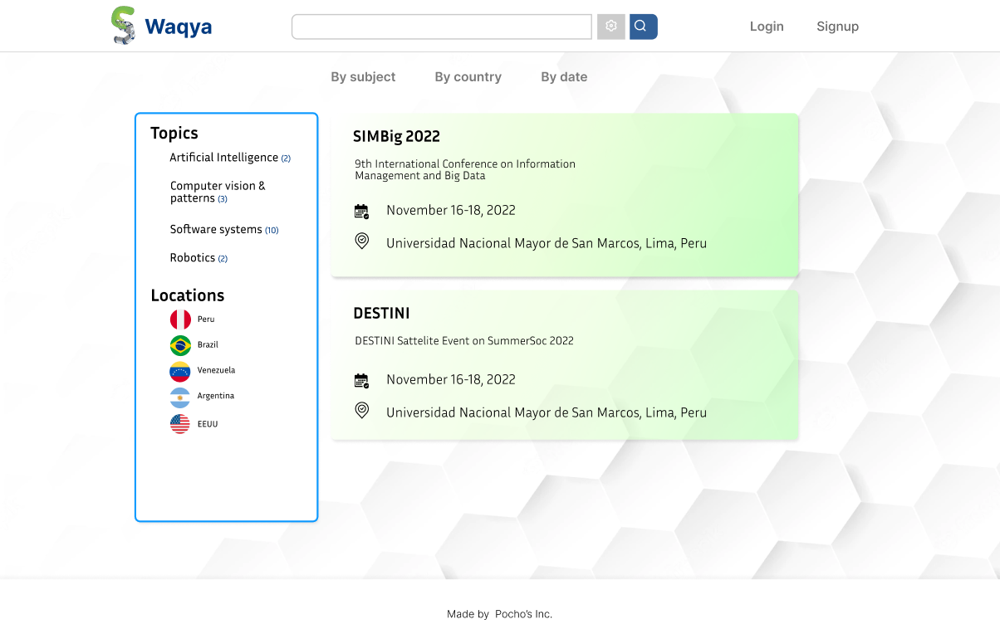
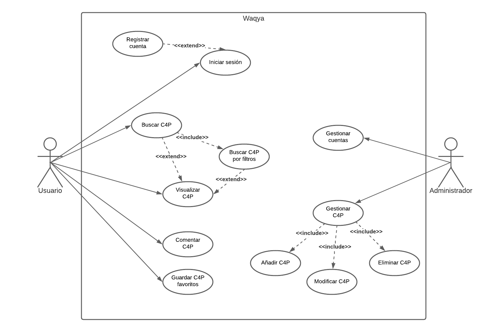
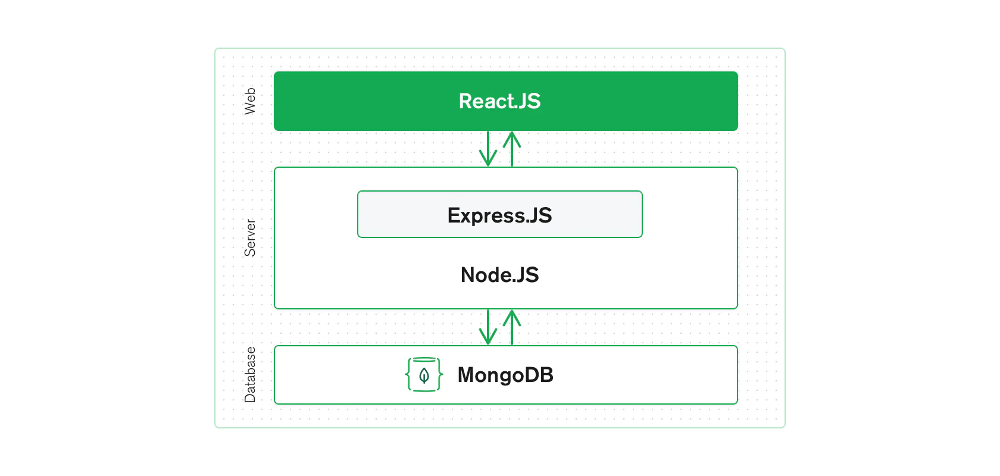
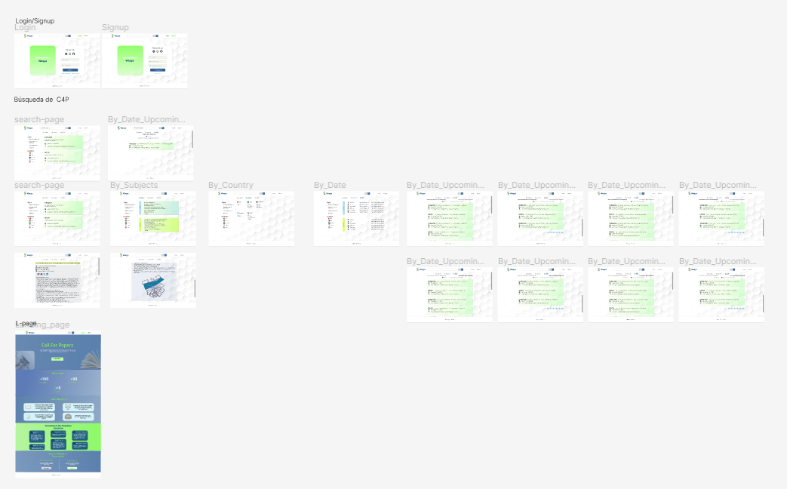

  

  
  
  

  
  
  

  

# Ingeniería de Software: Proyecto final de curso

## Perspectiva del producto: Waqya

Waqya se perfila a ser una plataforma web como un medio de difusión de llamados a publicar (_Call for papers_), mediante el cual los usuarios podrán visualizar, comentar y agregar a favoritos los principales _Call for papers_ (C4P) en seminarios, Conferencias, _Workshops_ y _Journals_ en los tópicos más relevantes del área de Ciencia de la Computación.

## Funcionalides del producto

  

## Características de los usuarios

  * **El usuario**: El usuario se entiende como un estudiante universitario de Ciencia de la Computación con interés en publicar artículos científicos, así como docentes investigadores y en general personas afines a la investigación en los principales tópicos del área de investigación de _Computer Science_. 

  * **El administrador**: El administrador estará compuesto básicamente por el équipo de desarrollo del proyecto Waqya, todos ellos estudiantes de la Carrera profesional de Ciencia de la Computación.

## Requisitos funcionales
1. **Visualizar los principales C4P**. El sistema visualizará en un panel los C4P con información referida al evento, fechas importantes, lugar en el que se realizará, directivas, guías y demás información necesaria para que el usuario esté informado sobre el proceso de postulación.

1. **Buscar C4P**. El sistema tendrá un mecanismo de búsqueda simple para buscar de forma genérica por cualquier campo que se le especifique.

1. **Buscar C4P por filtros**. Se proveerá el despliegue de opciones para poder hacer una búsqueda personalida por campos como Fechas, Tópicos, Lugares donde se realizará, etc.

1. **Comentar C4P**. Se proporcionará una sección en las publicaciones donde los usuarios podrán realizar comentarios, así mismo podrán interactuar entre ellos.

1. **Guardar C4P favoritos**. Se podrá guardar las publicaciones de interés para los usuarios registrados en la plataforma.

1. **Sucripción a un boletín**. El sistema tendrá un sistema de suscripción a un boletín a temas de interés personalizado.

1. **Registro con API's Google, Facebook y GitHub**: El sistema ofrecerá un sistema de registro para asociar cuentas de Google, Facebook y GitHub.

1. **Registro usual con correo y contraseña**. Así mismo se proveerá la opción de registrarse de forma tradicional con correo y contraseña.

1. **Inicio de sesión con API's Google, Facebook y GitHub**. Análogo a los anteriores requisitos.

1. **Inicio de sesión usual  con correo y contraseña**. Análogo a los anteriores requisitos.

## Requisitos no funcionales

1. **Desempeño**. El sistema presentará un almacenamiento basado en la nube (_Atlas Cluster_), ofreciendo confiabilidad a los usuarios. Teniendo un tiempo de respuesta óptima.

1. **Seguridad**. El acceso se realizará con tokens para encriptar las credenciales de acceso.

1. **Fiabilidad**. El sistema tendrá una confiabilidad moderada debido a las limitaciones de los recursos.

1. **Disponibilidad**. El sistema estará operando al 100% de sus funcionalidades a excepción de que se le esté dando mantenimiento o empiece a fallar algún servicio externo.

1. **Portabilidad**. El sistema debe ser adaptado de forma efectiva y eficiente a diferentes entornos determinados de software, operacionales o de uso. Y será ejecutado en diferentes plataformas.

1. **Usabilidad**. El sistema debe tener la característica de ser comprendido, fácil de usar y ser atractivo para el usuario. Adicionalmente se tiene que tener una tasa baja en errores.

## Diseño de arquitectura

La arquitectura elegida para la implementación del proyecto fue el _stack_ MERN. MERN significa MongoDB, Express, React, Node, después de las cuatro tecnologías clave que componen la pila.

* **MongoDB** - base de datos de documentos.
* **Express** (.js) - Marco web Node.js
* **React** (.js): un marco de JavaScript del lado del cliente
* **Node** (.js): el principal servidor web de JavaScript

  

Express y Node conforman el nivel medio (aplicación). Express.js es un marco web del lado del servidor y Node.js es la popular y potente plataforma de servidor de JavaScript. Independientemente de la variante que elija, ME(RVA)N es el enfoque ideal para trabajar con JavaScript y JSON, en todo momento.

Adicionalmente detallamos algunas de las tecnologías que adoptamos:

* **TypeScript**, como lenguaje de programación.
* **Chakra-UI**, como framework para la interfaz en React.
* **Framer-Motion**, como librería para manipular animaciones en React.

## Diseño del producto

El prototipo del producto se realizó en la herramienta Figma y se disponibiliza en el siguiente enlace:

> [Recurso figma del prototipo (producto mínimo viable)](https://www.figma.com/file/rAApUEZHezknffAMt8TrxC/ProtoV1?node-id=107%3A18)

  

## Contribuidores

<!-- ALL-CONTRIBUTORS-LIST:START - Do not remove or modify this section -->
<!-- prettier-ignore-start -->
<!-- markdownlint-disable -->

  <table align="center">
    <tr>
      <td align="center"><a href="https://github.com/reqhiem"> <b>Joel Perca</b></a> <a href="https://github.com/reqhiem" title="Code">
      <td align="center"><a href="https://github.com/MisaelVM"> <b>Misael Svante</b></a> <a href="https://github.com/MisaelVM" title="Code">
      </td>
      <td align="center"><a href="https://github.com/ElizabethYasmin"> <b>Elizabeth Yasmin</b></a> <a href="https://github.com/ElizabethYasmin" title="Code">
      <td align="center"><a href="https://github.com/EdgarEspinozaPE"> <b>Edgar Alfonso</b></a> <a href="https://github.com/EdgarEspinozaPE" title="Code">
      </td>
      <td align="center"><a href="https://github.com/ImaMos01"> <b>Imanol Brayan</b></a> <a href="https://github.com/ImaMos01" title="Code">
      </td>
    </tr>
  </table>